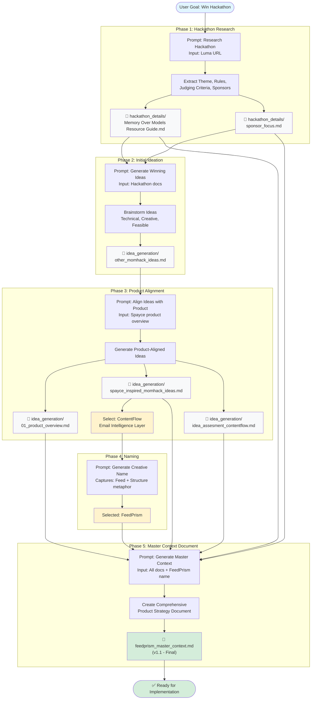

# FeedPrism: Hackathon Ideation & Planning Blueprint

This diagram shows the **ideal process flow** from hackathon research to Master Context Document, with recommended prompts and key outputs.



---

## Recommended Prompts (Blueprint)

### Phase 1: Hackathon Research
**Prompt:**
```
Research this hackathon and extract:
1. Theme and tracks
2. Judging criteria
3. Sponsor priorities (Qdrant, Lamatic)
4. Rules and constraints
5. Timeline

URL: [Luma hackathon link]

Output: Create 2 documents:
- hackathon_details/Memory Over Models Resource Guide.md
- hackathon_details/sponsor_focus.md
```

**Outputs:**
- `hackathon_details/Memory Over Models — AI Hackathon Resource Guide.md`
- `hackathon_details/sponsor_focus.md`

---

### Phase 2: Initial Ideation
**Prompt:**
```
Generate 5-10 hackathon ideas that:
1. Align with "Memory Over Models" theme
2. Use Qdrant (vector DB) as core technology
3. Are implementable in 7 days
4. Are technical, professional, and enterprise-focused
5. Solve real problems (not toys)

Context: Read hackathon_details/ documents

Output: Create idea_generation/other_momhack_ideas.md with shortlisted ideas
```

**Output:**
- `idea_generation/other_momhack_ideas.md`

---

### Phase 3: Product Alignment
**Prompt:**
```
Generate hackathon ideas that:
1. Win the hackathon (align with theme + sponsors)
2. Serve as production modules for Spayce product
3. Focus on email intelligence / content extraction

Context:
- Read: idea_generation/01_product_overview.md (Spayce vision)
- Read: hackathon_details/ (hackathon requirements)

Output: Create 3 documents:
- idea_generation/spayce_inspired_momhack_ideas.md (4 aligned ideas)
- idea_generation/idea_assesment_contentflow.md (detailed assessment of top idea)

Select top idea: ContentFlow (Email Intelligence Layer)
```

**Outputs:**
- `idea_generation/01_product_overview.md` (Spayce product overview)
- `idea_generation/spayce_inspired_momhack_ideas.md` (4 product-aligned ideas)
- `idea_generation/idea_assesment_contentflow.md` (ContentFlow assessment)

**Decision:** ContentFlow selected as winning idea

---

### Phase 4: Naming
**Prompt:**
```
Generate a creative name for an email intelligence system that:
1. Captures the metaphor: raw email feed → structured knowledge
2. Implies transformation/refraction (like a prism splitting light)
3. Is memorable, professional, and scalable
4. Works for both learning content (Phase 1) and general email intelligence (future)

Brainstorm 50+ names across categories:
- Optical metaphors (Prism, Lens, Refract)
- Flow/Stream metaphors (Feed, Flow, Stream)
- Memory metaphors (Recall, Echo, Amber)

Output: Select final name
```

**Output:** **FeedPrism** (Feed + Prism metaphor)

---

### Phase 5: Master Context Document
**Prompt:**
```
Generate a Master Context Document for FeedPrism hackathon project.

This document serves as the primary reference for humans and AI agents to understand:
- Why: Problem, vision, hackathon alignment
- What: Features, use cases, personas
- How: High-level architecture, Spayce integration
- When: 7-day execution plan

Requirements:
1. Product-strategy level (not low-level technical)
2. Include all features:
   - Content extraction (events, courses, blogs)
   - Actionable item extraction (RSVPs, deadlines)
   - Email tagging & classification
   - AI theme suggestions
3. Scope: Content-rich emails (newsletters, event invites, course announcements)
4. Vision: Phase 1 = Learning content; Phase 3 = General email intelligence
5. Integration: API-first design for Spayce

Context: Read all documents in:
- hackathon_details/
- idea_generation/

Output: feedprism_master_context.md (comprehensive strategy document)
```

**Output:**
- `feedprism_master_context.md` (v1.1 - Final Master Context Document)

---

## Key Files Summary

| Phase | File | Purpose |
|-------|------|---------|
| 1 | `hackathon_details/Memory Over Models — AI Hackathon Resource Guide.md` | Hackathon theme, rules, timeline |
| 1 | `hackathon_details/sponsor_focus.md` | Qdrant/Lamatic priorities |
| 2 | `idea_generation/other_momhack_ideas.md` | Generic hackathon ideas (Recall, Guardian) |
| 3 | `idea_generation/01_product_overview.md` | Spayce product vision |
| 3 | `idea_generation/spayce_inspired_momhack_ideas.md` | Product-aligned ideas (ContentFlow, GraphMind, etc.) |
| 3 | `idea_generation/idea_assesment_contentflow.md` | ContentFlow detailed assessment |
| 4 | *(Decision)* | Name: **FeedPrism** |
| 5 | **`feedprism_master_context.md`** | **Final Master Context Document (v1.1)** |

---

## Process Characteristics

- **Linear Flow:** Each phase builds on previous outputs
- **Document-Driven:** Every phase produces concrete artifacts
- **Iterative Refinement:** Ideas refined through product alignment
- **Strategic Focus:** High-level blueprint, not implementation details
- **Reusable:** Process can be replicated for future hackathons

---

## Total Timeline
- **Duration:** ~3 days (with breaks)
- **Active Work:** ~8-10 hours
- **Phases:** 5 major phases
- **Documents Created:** 7 key files
- **Final Output:** Production-ready Master Context Document
