# FeedPrism: Actual Process Execution Log

This document captures the **actual step-by-step process** used to arrive at the FeedPrism Master Context Document, including real prompts, inputs, outputs, and iterations.

---

## Process Flow Diagram

```mermaid
graph TB
    Start([User: Participate in Hackathon]) --> P1_1

    subgraph Phase1[Phase 1: Hackathon Research]
        P1_1[User: Research hackathon<br/>Input: Luma URL] --> Browse[Agent: Browse Luma page<br/>Extract theme, rules, sponsors]
        Browse --> Doc1["📄 Memory Over Models<br/>Resource Guide.md"]
        Browse --> Doc2["📄 sponsor_focus.md"]
    end

    Doc1 --> P2_1
    Doc2 --> P2_1

    subgraph Phase2[Phase 2: Initial Ideation - 3 Rounds]
        P2_1[User: Generate ideas] --> R1[Round 1: Generic Ideas<br/>Recall, VibeCheck, etc.]
        R1 --> F1{User: Too simple}
        F1 --> R2[Round 2: Technical Ideas<br/>Terminal Recall, Guardian]
        R2 --> F2{User: Align with product}
        F2 --> R3[Round 3: Product-aligned]
        R3 --> Doc3["📄 other_momhack_ideas.md<br/>Shortlist: Recall, Guardian"]
    end

    Doc3 --> P3_1

    subgraph Phase3[Phase 3: Product Alignment]
        P3_1[User: Align with Spayce<br/>Input: Product overview] --> ReadProduct[Agent: Read Spayce vision]
        ReadProduct --> Doc4["📄 01_product_overview.md"]
        ReadProduct --> GenIdeas[Generate 4 Product Ideas]
        GenIdeas --> Doc5["📄 spayce_inspired_momhack_ideas.md<br/>ContentFlow, GraphMind, etc."]
        GenIdeas --> Doc6["📄 idea_assesment_contentflow.md"]
        Doc5 --> Select[User: Select ContentFlow]
    end

    Select --> P4_1

    subgraph Phase4[Phase 4: Naming - 4 Rounds]
        P4_1[User: Better names] --> N1[Round 1: InboxMind variants]
        N1 --> NF1{User: Not creative}
        NF1 --> N2[Round 2: Creative names<br/>Akasha, Engram, Prism]
        N2 --> NF2{User: Like Prism}
        NF2 --> N3[Round 3: Prism variants<br/>PrismFlow, Spectra]
        N3 --> NF3{User: Explore metaphors}
        NF3 --> N4[Round 4: Feed + Prism]
        N4 --> NameFinal[User: Select FeedPrism]
    end

    NameFinal --> P5_1
    Doc1 --> P5_1
    Doc2 --> P5_1
    Doc4 --> P5_1
    Doc5 --> P5_1
    Doc6 --> P5_1

    subgraph Phase5[Phase 5: Master Context Document]
        P5_1[User: Generate Master Context] --> ReadAll[Agent: Read all docs]
        ReadAll --> GenDoc[Generate 12-section document]
        GenDoc --> Doc7v1["📄 contentflow_master_context.md<br/>v1.0"]
        Doc7v1 --> P5_2[User: Rename + Expand scope]
        P5_2 --> Update[Agent: Update document<br/>1. Rename to FeedPrism<br/>2. Content-rich emails<br/>3. Add 3 features<br/>4. General email intelligence]
        Update --> Doc7v2["📄 feedprism_master_context.md<br/>v1.1 - FINAL"]
    end

    Doc7v2 --> P6_1

    subgraph Phase6[Phase 6: Process Documentation]
        P6_1[User: Create process diagram] --> Diagram1[Agent: Detailed flow]
        Diagram1 --> F6_1{User: Too detailed}
        F6_1 --> Blueprint[Agent: Simplified blueprint]
        Blueprint --> Doc8["📄 hackathon_ideation_blueprint.md"]
        Doc8 --> P6_2[User: Add execution log]
        P6_2 --> ThisDoc["📄 master_context_generation.md<br/>This document"]
    end

    ThisDoc --> End([✅ Complete: Ready for Hackathon])

    style Start fill:#e1f5ff
    style End fill:#d4edda
    style Select fill:#fff3cd
    style NameFinal fill:#fff3cd
    style Doc7v2 fill:#d4edda
    style Doc1 fill:#f8f9fa
    style Doc2 fill:#f8f9fa
    style Doc3 fill:#f8f9fa
    style Doc4 fill:#f8f9fa
    style Doc5 fill:#f8f9fa
    style Doc6 fill:#f8f9fa
    style Doc7v1 fill:#fff3cd
    style Doc8 fill:#f8f9fa
    style ThisDoc fill:#f8f9fa
```



---

## Phase 1: Hackathon Research

### Step 1.1: Initial Research Request
**User Prompt:**
```
I want to participate in this hackathon. Help me understand the requirements and brainstorm ideas.
URL: https://luma.com/99y6hhur?tk=ok5SjG
```

**Agent Actions:**
1. Browsed Luma hackathon page
2. Extracted key information:
   - Theme: "Memory Over Models"
   - Sponsors: Qdrant (main), Lamatic, AI Collective
   - Tracks: Unstructured Data RAG, AI Second Brain, Domain-Specific AI
   - Deadline: November 30th, 12 PM IST
   - Judging: Functionality, Originality, Completeness, Relevance, Presentation

**Outputs Created:**
- `hackathon_details/Memory Over Models — AI Hackathon Resource Guide.md`
- `hackathon_details/sponsor_focus.md`

---

## Phase 2: Initial Ideation (3 Rounds)

### Step 2.1: First Idea Generation
**User Prompt:**
```
Generate hackathon ideas based on the research.
```

**Agent Actions:**
- Generated 5 initial ideas:
  1. **Recall** - Context-Aware Meeting Copilot
  2. **VibeCheck** - Semantic Scene Search for Movies
  3. **CodeGenealogy** - Codebase Time Machine
  4. **SecondSelf** - AI Biographer
  5. **LegalLens** - Precedent Pattern Matcher

**User Feedback:**
```
I like Recall, but these feel too simple/consumer-focused. 
Give me more professional, technical ideas.
```

### Step 2.2: Second Idea Generation (Refined)
**Agent Actions:**
- Generated professional/technical ideas:
  1. **Recall** - Context-Aware Meeting Copilot (refined)
  2. **Terminal Recall** - Self-Healing CLI
  3. **DealFlow** - Real-Time Negotiation Agent
  4. **Guardian** - Contextual Compliance Shield

**User Feedback:**
```
Shortlist Recall and Guardian. But I want ideas that align with my product (Spayce).
```

**Outputs Created:**
- `idea_generation/other_momhack_ideas.md` (Recall & Guardian shortlisted)

---

## Phase 3: Product-Aligned Ideation

### Step 3.1: Product Context Request
**User Prompt:**
```
Generate hackathon ideas that align with my Spayce product vision.
Spayce is a Personal Learning Management System (PLMS) with:
- Hierarchical Spaces/Sub-Spaces
- Email integration for content extraction
- AI-powered content hierarchy
- Multi-source integration (websites, email, courses)
```

**Agent Actions:**
1. Read `idea_generation/01_product_overview.md` (Spayce vision)
2. Generated 4 product-aligned ideas:
   - **ContentFlow** (Email Content Extractor) ⭐ Top recommendation
   - **GraphMind** (Auto-Generated Learning Graph)
   - **ContextCombo** (Multi-Context Workflow Engine)
   - **SmartScheduler** (Learning Calendar Optimizer)

**Outputs Created:**
- `idea_generation/spayce_inspired_momhack_ideas.md` (4 ideas)
- `idea_generation/idea_assesment_contentflow.md` (detailed ContentFlow assessment)

**User Decision:**
```
ContentFlow looks promising. Let's proceed with this.
```

---

## Phase 4: Naming & Branding

### Step 4.1: Initial Name Request
**User Prompt:**
```
Think of better names for this idea (ContentFlow).
```

**Agent Actions:**
- Generated name categories:
  - **InboxMind** variants (InboxMind.ai, AI InboxMind)
  - **Memory-focused** (Engram, Cortex, Echo, Deja, Amber)
  - **Visibility-focused** (MailSurface, UnburyAI, InboxLens)

**User Feedback:**
```
I like Prism, Nebula but these are plain English words. Be more creative.
```

### Step 4.2: Creative Names Round
**Agent Actions:**
- Generated creative names:
  - **Akasha** (Akashic Records - cosmic library)
  - **Engram** (physical trace of memory)
  - **Memex** (Vannevar Bush's vision)
  - **Prism** (light refraction metaphor)
  - **Constellation**, **Loom**, **Mnemos**

**User Feedback:**
```
I like Prism. Give variants related to Prism.
```

### Step 4.3: Prism Variants
**Agent Actions:**
- Generated Prism-based names:
  - **PrismFlow**, **MemPrism**, **ContextPrism**
  - **Spectra**, **Refract**, **Lumen**
  - **Prismic**, **Prisma**, **Prismoid**

**User Feedback:**
```
What are synonyms of "content"? What words do similar things as prism?
What words describe a stream of raw messy data?
```

### Step 4.4: Final Name Selection
**Agent Actions:**
- Explored metaphors:
  - Content synonyms: Context, Lore, Signal, Essence
  - Prism alternatives: Lens, Filter, Distill, Geode
  - Messy data streams: Flux, Torrent, Static, Feed

**User Decision:**
```
I like the name FeedPrism.
```

**Final Name:** **FeedPrism** (Feed + Prism metaphor)

---

## Phase 5: Master Context Document Generation

### Step 5.1: Initial Document Request
**User Prompt:**
```
Create a Master Context Document for this hackathon idea.
It should serve as the main reference for any human/AI to understand:
- Why/what/how we are building this
- Like a PRD++ for the idea
- High-level tech details (not low-level)
- Detailed features, use cases, user journeys
```

**Agent Actions:**
1. Read all documentation:
   - `hackathon_details/Memory Over Models Resource Guide.md`
   - `hackathon_details/sponsor_focus.md`
   - `idea_generation/spayce_inspired_momhack_ideas.md`
   - `idea_generation/idea_assesment_contentflow.md`
   - `idea_generation/01_product_overview.md`

2. Generated comprehensive document with 12 sections:
   - Executive Overview
   - Vision & Goals
   - Key Personas (End-User, Judge)
   - High-Level System Concept
   - Core Features (8 features)
   - Use Cases & User Journeys (5 journeys)
   - Spayce Integration Context
   - Hackathon Alignment
   - Success Criteria
   - Risks & Considerations
   - 7-Day Execution Plan
   - Clarifying Questions

**Output Created:**
- `contentflow_master_context.md` (v1.0)

### Step 5.2: Rename & Scope Expansion
**User Prompt:**
```
I like FeedPrism. Update the document:
1. Rename ContentFlow → FeedPrism everywhere
2. Broaden scope: Not just newsletters, but all content-rich emails
3. Add new features:
   - Actionable item extraction (RSVPs, deadlines)
   - Email tagging & classification (tag ALL emails)
   - AI theme suggestions (auto-suggest themes, user configures)
4. Vision: Start with learning content, expand to general email intelligence
```

**Agent Actions:**
1. Renamed file: `contentflow_master_context.md` → `feedprism_master_context.md`
2. Global find-replace: ContentFlow → FeedPrism
3. Updated scope:
   - "newsletters" → "content-rich emails" (newsletters, event invites, course announcements)
   - Added email types: transactional, personal, promotional
4. Added 3 new core features (Features #9, #10, #11):
   - Actionable Item Extraction
   - Email Tagging & Classification
   - AI Theme Suggestions
5. Updated vision:
   - Phase 1: Learning content (hackathon)
   - Phase 3: General Email Intelligence (work & personal)
6. Updated conceptual flow diagram
7. Updated personas, success criteria, hackathon alignment

**Output Updated:**
- `feedprism_master_context.md` (v1.1 - Final)

---

## Phase 6: Process Documentation

### Step 6.1: Process Flow Diagram
**User Prompt:**
```
Generate a Mermaid diagram showing the flow of the process done till now, 
referring to all files created/used.
```

**Agent Actions:**
- Created initial detailed flow with all iterations and feedback loops

**User Feedback:**
```
Make it less detailed. Don't capture micro-steps like user feedback loops.
More blueprint-like. Consolidate naming into a single step.
```

### Step 6.2: Blueprint Document
**Agent Actions:**
- Created simplified blueprint with:
  - 5 clear phases (linear)
  - Ideal prompts (what should be asked)
  - All file outputs
  - No micro-steps or feedback loops

**Output Created:**
- `hackathon_ideation_blueprint.md`

### Step 6.3: Actual Execution Log
**User Prompt:**
```
Create another file that expands the blueprint into step-by-step process flow 
with actual prompts used, inputs, outputs. Not too cyclical but should capture 
the overall flow.
```

**Agent Actions:**
- Created this document: `actual_process_execution.md`

---

## Summary: Files Created

| Phase | File | Purpose |
|-------|------|---------|
| 1 | `hackathon_details/Memory Over Models — AI Hackathon Resource Guide.md` | Hackathon research |
| 1 | `hackathon_details/sponsor_focus.md` | Sponsor priorities |
| 2 | `idea_generation/other_momhack_ideas.md` | Initial ideas (Recall, Guardian) |
| 3 | `idea_generation/01_product_overview.md` | Spayce product vision |
| 3 | `idea_generation/spayce_inspired_momhack_ideas.md` | Product-aligned ideas |
| 3 | `idea_generation/idea_assesment_contentflow.md` | ContentFlow assessment |
| 5 | **`feedprism_master_context.md`** | **Master Context Document (v1.1)** |
| 6 | `hackathon_ideation_blueprint.md` | Ideal process blueprint |
| 6 | `actual_process_execution.md` | This document (actual execution) |

---

## Key Iterations & Refinements

### Ideation Iterations:
1. **Round 1:** Generic ideas → User: "Too simple"
2. **Round 2:** Technical ideas → User: "Align with product"
3. **Round 3:** Product-aligned ideas → **ContentFlow selected**

### Naming Iterations:
1. **Round 1:** InboxMind variants → User: "Not creative enough"
2. **Round 2:** Creative metaphors (Akasha, Engram, Prism) → User: "Like Prism"
3. **Round 3:** Prism variants → User: "Explore feed/stream metaphors"
4. **Final:** **FeedPrism** selected

### Document Iterations:
1. **v1.0:** ContentFlow Master Context (newsletters only)
2. **v1.1:** FeedPrism Master Context (content-rich emails, 3 new features, general email intelligence vision)

---

## Timeline

- **Start:** Nov 21, 2025 (~15:54 IST)
- **End:** Nov 24, 2025 (~09:56 IST)
- **Duration:** ~3 days (with breaks)
- **Active Work:** ~8-10 hours across multiple sessions

---

## Process Characteristics

- **Iterative Refinement:** Ideas evolved through user feedback
- **Document-Driven:** Every phase produced concrete artifacts
- **User-Guided:** User steered direction at key decision points
- **Comprehensive Output:** Final document is production-ready
- **Reusable Process:** Can be replicated for future hackathons
